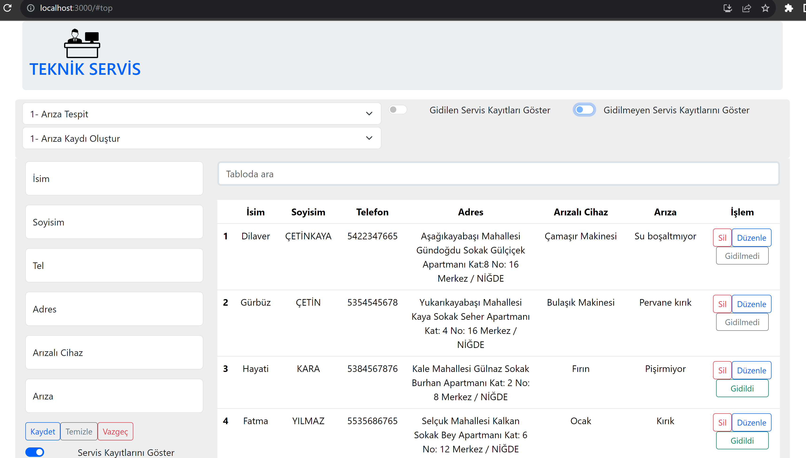

# WHITE GOODS TECHNICAL SERVICE (BEYAZ EŞYA TEKNİK SERVİSİ) #

<ul>
  <li>Beyaz Eşya Teknik Servis Uygulaması için kullandığım teknolojiler: Javascript, React, Json-Server ve Axios kütüphanesi 

  The technologies I use for White Goods Technical Service Application: Javascript, React, Json-Server and Axios library.  
  </li>
  <li>
  Veritabanı olarak Json-Server Kütüphanesi kullanılmıştır. Axios Kütüphanesi ile veriler db.json dosyasından çekilmiştir.

  Json-Server Library was used as the database. Data was extracted from the db.json file with Axios.
  </li>
  <li>
  Modal yazarken pure css ve Bootstrap kullanılmıştır. Diğer kısımlardaki css işlemleri için Boostrap Kütüphanesi kullanılmıştır.

  Pure css was used when writing modal. Boostrap Library is used for css operations in other parts.
  </li>
  <li>
  Bu projede React Kütüphanesi kullanılmıştır. Crud diye isimlendirilen Create, Read, Update ve Delete işlemleri temelinde teknik servis kayıtları oluşturabildiğimiz, kayıtları silebildiğimiz, 
  düzenleyebildiğimiz, ilgili servise gidilip gidilmediğini bildirebildiğimiz, kayıtları gidilen servis kayıtları ve gidilmeyen servis kayıtları şeklinde listeleyebildiğimiz, yeni kayıt oluştururken hata 
  denetimini yapabildiğimiz bir  
  uygulamadır. İsme, soyisme, telefon numarasına, adresine, arızalı cihaz ismine ve arıza ismine göre arama yapabilmekteyiz.

  React Library was used in this project. On the basis of Create, Read, Update and Delete operations called Crud, we can create technical service records, delete records, edit records, report whether the 
  relevant service has been visited, list records as service records visited and service records not visited, and perform error checking when creating a new record.  
  application. We can search by name, surname, phone number, address, defective device name and fault name.
  </li>
</ul>

## Project gif file (Proje gif dosyası) ##

